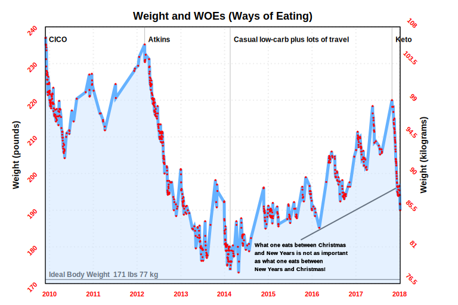
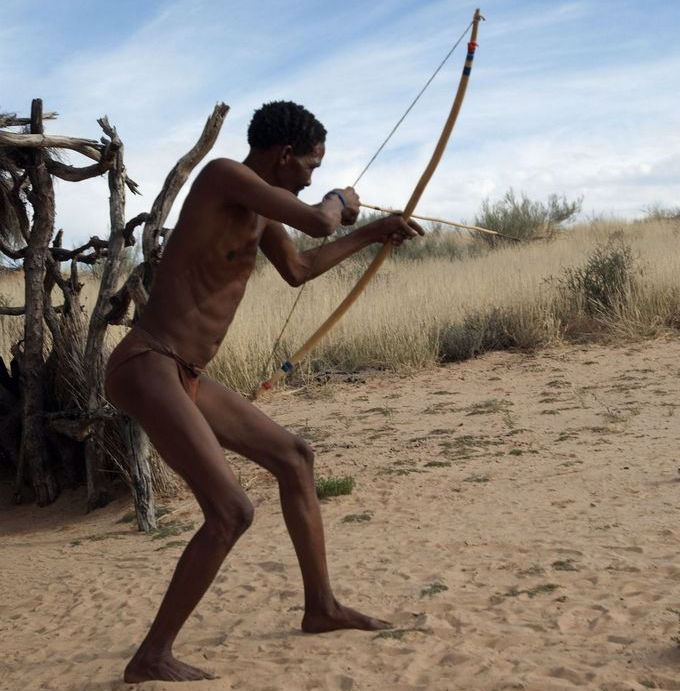

# How I Lost 50 Pounds, For Free, On Keto

This my explanation of how I lost 50 pounds on [keto](https://en.m.wikipedia.org/wiki/Ketogenic_diet). I did this, quickly, without needing to buy any special food prep devices, magic powders, strange foods, or -- and this might be the best of all -- exercise. I'll be as brief as possible, with some explanation below, and some inline links to resources I've found useful.

<u>Obligatory liability warning</u>: This is merely **my** anecdotal experience. Consult your doctor before adopting any diet or exercise regimen. Nothing here should be construed as medical advice.

## How Do I Get Thin?

There are only two steps to get thin.

1. Get into the right frame of mind. The weight loss phase is a **limited period of time** during which you'll eat a limited variety of food. No cheat days during this loss phase. Deal with it! You can do it! Cheat later.

2. Weigh, log, and eat (in that order) only foods that tell your body to consume your fat for energy.

Details on how to do this are only a few paragraphs below; hang on.

## How Did I Get Fat?

By eating a balance of foods that's been telling your body to store what you eat as fat.

### Everything I Knew About Dieting Is Wrong!

My grandmother repeatedly said "meat makes meat". My mother was all about whole wheat bread, vegetables, rice, and pasta. It's terrifying how wrong they were. Look at the population around you; we're fatter than we've ever been, to the point of using up a major part of our national wealth on medical care for the fat: from juvenile diabetes to all the dire consequences of adult obesity.

Delve into the scientific literature if you want, or watch the best documentary that I've found thus far, [The Perfect Human Diet](http://www.imdb.com/title/tt2014248/) (2012).

You'll have to let go of all the folk wisdom family and friends have been broadcasting as the truth since you were a baby. It's all wrong. We have science, we **know** what our bodies need to not be pudgy.

## How Do I Get Thin, In Detail

Evolutionarily speaking, you're a bushman with a smartphone. Your body is optimized to efficiently live from stored fat. Over at least the last 100,000 years your <a href="https://www.sciencedaily.com/releases/2017/06/170607133246.htm">engine expects a diet</a> of mostly meat, some foraged veggies, and very intermittent delicious treats of berries, honey, etc. Mostly fat and protein.

When sweet treats are eaten a metabolic toggle is flipped so we get energy from the delights and STORE THE EXTRA AS BODY FAT; who knows when the tribe will next encounter such wonderful things?

Complely unknown in the African bush were high-carbohydrate "healthy" foods. No bread, pasta, power bars, bowls of fruit salad, and especially no refined sugar or high-fructose corn syrup (which is everywhere in our Standard American Diet (SAD)).

Of course we're fat! How do we **ever** expect to thrive on our modern diet?
 

### How To Start

#### Take 'Before' Pictures

#### Figure Out Your Ideal Weight

#### Buy A Food Scale

#### Pick A Mobile App

#### Empty Your Fridge Of High-Carb Foods

#### Stock Your Fridge With Low-Carb Foods

#### Weigh And Log All Foods BEFORE you cook / eat them

#### Exercise, Forget About It!

### You Already Have A Six-Pack!

A bit of encouragement before we actually start. You already have a six-pack, which you've cleverly hidden under fat. You burn away the fat to uncover your muscular glory.

#### Keto Flu, Keto Rage

### Things I Eat

#### Salami & Eggs

#### Tunafish, Mayo, and Pickles

#### Hamburger, Onion Rings, Mayo, Cheese

### Cheat Days?

No. See above.

## How Does Keto Work?

Here's a tiny bit of detail into how keto works.

### Calories In, Calories Out (CICO)

### Tell Your Body To Get Energy From Your Fat

## How Do I Maintain My Goal Weight?

I don't yet know. I hit my goal weight a few years ago but then stopped being mindful (and regained 2/3 of what I'd lost). When I next hit my goal weight, in about six weeks, I'll start to experiment with what I've read about weight maintenance, write about it, and post it here.