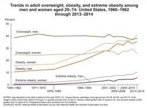
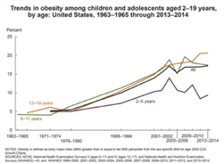
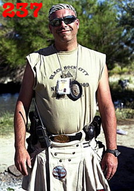
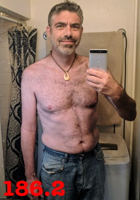
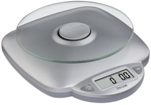

# Simple, Sane, and Simple Keto

This my explanation of how I lost 50 pounds on [keto](https://en.m.wikipedia.org/wiki/Ketogenic_diet). I did this, quickly, without _needing_ to buy any special food prep devices, magic powders, strange foods, or -- and this might be the best of all -- exercise. I'll be as brief as possible, with some explanation below, and some inline links to resources I've found useful.

<u>Obligatory liability warning</u>: This is merely **my** anecdotal experience. Consult your doctor before adopting any diet or exercise regimen. Nothing here should be construed as medical advice.

## How Do I Get Thin?

There are exactly two steps necessary to get thin.

1. **Get into the right frame of mind.** The weight loss phase is a **limited period of time** during which you'll eat a limited variety of food. No cheat days during this loss phase. Deal with it! You can do it! Cheat later.

2. **Weigh, log, and eat** (in that order) only foods that consume your body fat for energy.

Details on how to do this are only a few paragraphs below; hang on.

## How Did I Get Fat?

By eating only foods that tell your body to store what you eat as fat, and eating a quantity that powers your body (and no more).

### Everything I Knew About Dieting Is Wrong!

Almost all foods touted as "healthy" are very much just the opposite, causing you to add to your body fat -- very disheartening.

My grandmother repeatedly said "meat makes meat" (eating meat makes one fat); she and my mother was all about whole wheat bread, vegetables, rice, and pasta. It's terrifying how wrong they were. Look at the population around you; we're <a href="https://www.niddk.nih.gov/health-information/health-statistics/overweight-obesity">fatter than we've ever been</a>, to the point of using up a major part of our national wealth on medical care for the fat: from juvenile diabetes to all the dire consequences of adult obesity.

<table>
	<tr>
		<td><a href="https://www.niddk.nih.gov/health-information/health-statistics/overweight-obesity"> Adults, 1960-2014</a></td>
		<td><a href="https://www.niddk.nih.gov/health-information/health-statistics/overweight-obesity"> Children, 1960-2014</a></td>
	</tr>
</table>

Delve into the scientific literature if you want, or watch the best documentary that I've found thus far, [The Perfect Human Diet](http://www.imdb.com/title/tt2014248/) (2012). Or read a <a href="http://bigthink.com/21st-century-spirituality/how-the-keto-diet-with-no-exercise-outperforms-the-standard-american-diet-with-exercise">good article for layman</a>.

You'll have to let go of all the folk wisdom family and friends have been broadcasting as the truth since you were a baby. It's all wrong. We now have <a href="https://www.ncbi.nlm.nih.gov/pmc/articles/PMC3945587/">nutritional science</a>, we **know** what our bodies need to not be pudgy.

## How Do I Get Thin, In Detail

Evolutionarily speaking, you're a bushman with a smartphone. Your body is optimized to efficiently live from stored fat. Over at least the last 100,000 years your <a href="https://www.sciencedaily.com/releases/2017/06/170607133246.htm">engine expects a diet</a> of mostly meat, some foraged veggies, and very intermittent delicious treats of berries, honey, etc. Mostly fat and protein.

When sweet treats (sugars) are eaten a metabolic toggle is flipped so we get energy from the delights and STORE THE EXTRA AS BODY FAT; who knows when the tribe will next encounter such wonderful things?

Complely unknown in the African bush were high-carbohydrate "healthy" foods (which are turned into sugars). No bread, pasta, power bars, bowls of fruit salad, and especially no refined sugar or high-fructose corn syrup (which is everywhere in our Standard American Diet (SAD)).

Of course we're fat! We're eating the wrong fuel and storing the energy as body fat. 

### How To Start

#### Take 'Before' Pictures

If you're reading this, interested in weight loss, you may not be thrilled with your body right now.

Trust me, take 'before' pictures; they'll be an unbelievable reward a few months down the road. I didn't and I regret it. The closest that I have I'm showing here. 

Remember that everyone's progress is different, starting with gender and finishing with calorie deficit, adherence to the macrs (macronutrient numbers), and cheat days (which you won't have).
 

#### Figure Out Your Ideal Weight

It's good to know what modern medicine thinks is your <a href="https://www.calculator.net/ideal-weight-calculator.html">ideal weight</a>. It may not be _your_ target, but it's _a_ target. Aim at whatever weight you desire, but get an outside unbiased opinion.

#### Know The Quantities You're Eating

The only way to be sure you're (1) eating less than your calorie target (2) getting your macronutrients (macros) is to know the quantities. In the beginning I would, for example, use only known amounts; the weight on the steak package, or the number of eggs. You can make this work, but it's difficlt. Quickly I bought a set of measuring spoons, a 2-cup measure, and a food scale. Optional, but makes losing weight much more assured. 

#### Pick A Mobile App

To succeed you'll need to weight and log everything that passes your lips **before** its consumed: suprises abound in foods. Look for a tracker with both a website and smartphone app; consider <a href="http://loseit.com/">LoseIt!</a> or <a href="https://www.myfitnesspal.com/">MyFtnessPal</a>.

#### Empty Your Fridge Of High-Carb Foods

I can't stress this enough. If I had "bad" foods within reach I was certain to eat it. Give away <u>everything</u> that will sabotage your weight loss; be ruthless. If you're sharing living space carve out a cabinet as yours; label it "Keep Out - Keto Only".

#### Stock Your Fridge With Low-Carb Foods

Read labels! 

#### Weigh And Log All Foods BEFORE you cook / eat them

#### Exercise? Forget About It!

#### Get Support From The Community

* [Keto for Normies](http://ketoconnect.libsyn.com/website)

#### You Already Have A Six-Pack!

A bit of encourage  ment before we actually start. You already have a six-pack, which you've cleverly hidden under fat. You burn away the fat to uncover your muscular glory.

#### Keto Flu, Keto Rage

### Things I Eat

#### Salami & Eggs

#### Tunafish, Mayo, and Pickles

#### Hamburger, Onion Rings, Mayo, Cheese

### If you're tired of starting over, don't give up!

Cheat days? Sabotage meals? None during your limited weight-loss phase. You'll figure it out when you're in maintenance phase. ("If something is important to you you'll find a way. If it is not you'll find an excuse.")

## How Does Keto Work?

Here's a tiny bit of detail into how keto works.

### Calories In, Calories Out (CICO)

### Tell Your Body To Get Energy From Your Fat

## How Do I Maintain My Goal Weight?

I don't yet know. I hit my goal weight a few years ago but then stopped being mindful (and regained 2/3 of what I'd lost). When I next hit my goal weight, in about six weeks, I'll start to experiment with what I've read about weight maintenance, write about it, and post it here.