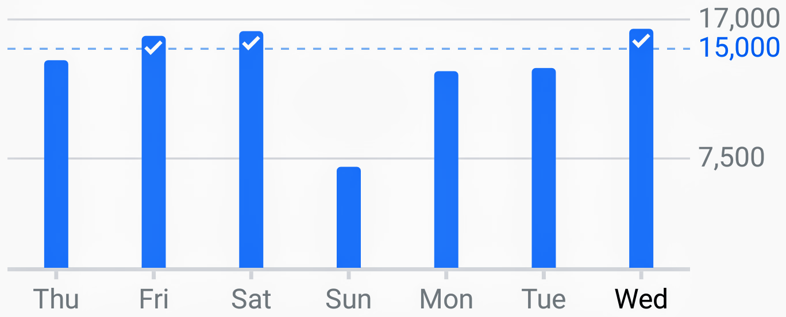
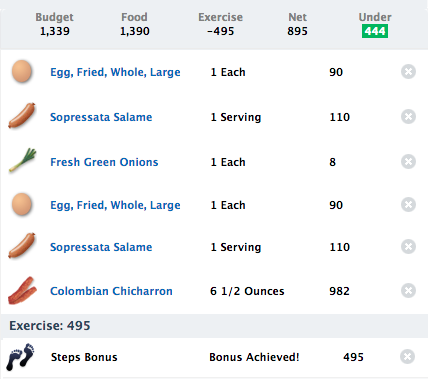
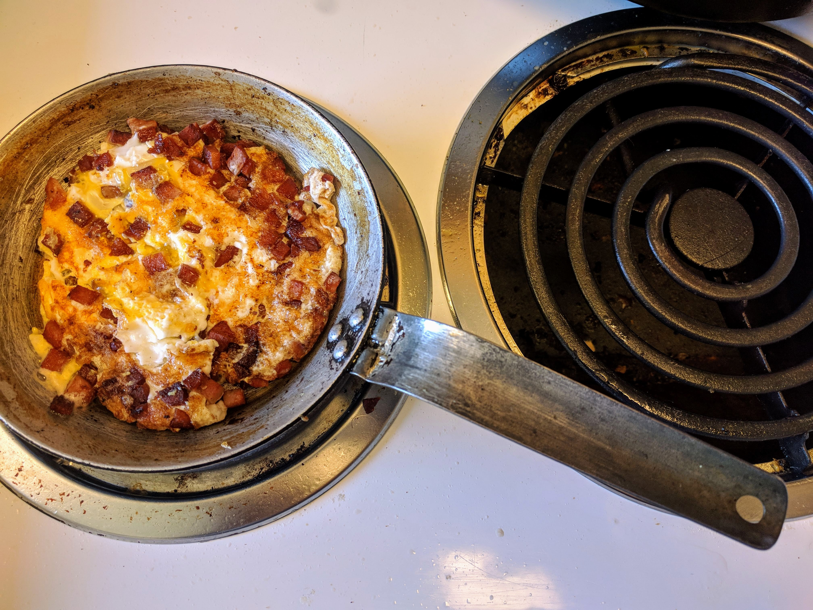
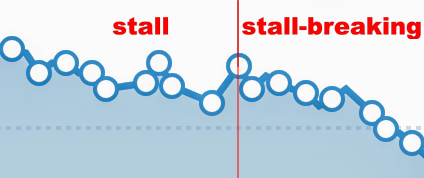

# Breaking a keto stall

A normal part of [ketogenic](https://github.com/mickeys/lose-weight-keto/blob/master/simplest-keto-how-to-start.md) is losing weight in fits and starts rather than in a regular pattern. These "stalls" often cause frustration and can lead to becoming disillusioned with keto. 

A stall is generally understood to be a plateau that lasts several weeks. I was losing weight daily so even a one-week stall challenged my patience. (The [reddit keto community](https://www.reddit.com/r/keto/) is an invaluable aid in understanding keto and stalls.)

What follows is how I broke my keto stall. What works for me may not work for you. Also, consult a physician.

## A summary of keto

To lose weight one has to **simultaneously** and **continuously**:

1. Eat less calories than you burn **AND**
2. Eat less carbohydrates than the amount that'll trigger an insulin response (which blocks fat cells from releasing fat for use)

Let's examine these requirements.

### TDEE & CICO

Your TDEE ([Total Daily Energy Expenditure](https://en.wikipedia.org/wiki/Basal_metabolic_rate)) is the count of calories your body uses to keep you alive and moving around.

The CICO (Calories In, Calories Out) model posits that as long as you eat fewer calories than you burn -- your TDEE + daily exercise -- you'll lose weight.

We now understand -- through the writings and research of [Dr Stephen Phinney](http://www.artandscienceoflowcarb.com/), [Dr Jeff Volek](http://www.artandscienceoflowcarb.com/), [Dr Eric Westman](https://www.adaptyourlife.com/about-us/dr-westman/), [Dr Jason Fong](https://idmprogram.com/), [Prof Tim Noakes](https://en.wikipedia.org/wiki/Tim_Noakes), and [Gary Taubes](https://en.wikipedia.org/wiki/Gary_Taubes) -- that we have to attend to more than just calories; not all calories are equal.

### Carbohydrate intake

Fat cells hold on to fat in the presence of insulin, generally regardless of caloric intake. That's why you'll have to ensure that you eat less than 20 mg of carbohydrates daily.

You can get values for your TDEE and appropriate macronutrient requirements through a [keto calculator](https://keto-calculator.ankerl.com/). (It's suggested that you specify "sedentary" for lifestyle, a caloric deficit of 20 percent, and a maximum carbohydrate intake of 20 mg/day.

## How I broke my stall

Despite months of good progress, solidifying my confidence in my ability to choose and log my food, I realized _something_ was wrong. 

It wasn't exercise (a consistent 15,000 steps daily) or calories (I log everything before it goes into my mouth) so it must have been carbs sneaking in somewhere. My solution was to figure out how to skate as close as possible to zero carbs.

Here's what I changed:

1. Started drinking my coffee black. The carbs in Trader Joe's coconut creamer (a lesser-carb whitener) must have been adding up. I've substituted two pinches of salt for every pot I've brewed. Zero carbs!
* Changed my food to be mind-numbingly simple through this transition period; options result in errors. I can stand the food boredom for a while :-)
* Instead of my usual intermittent fasting one-meal-a-day I nibble when I'm hungry, from waking to bed-time.
* Make sure I eat my calorie allocation (with my caloric deficit set at 30 percent).

## food specifics

What am I primarily eating for breakfast, lunch, and dinner? Well, mostly _chicharrón con carne_, pork rinds with meat still attached. (Buy these from your local Mexican grocery store; they may know it as _chicharrón carnada_ or _chicharrón Colombiano_.) This is what I see at my _mercado_:

The best thing about _chicharrón_ is that I can space bites around the clock (if I'm bored) or wait until a mealtime. It's also very filling; some days it's hard to eat all my calories.

Here's the basic nutritional information for the _chicharrón con carne_:

| **Calories**  | 151  | serving size| 1 oz |
|---|---|---|---|
| **Total Fat** | 11 g | **Sugars** | 0 |
| &nbsp;&nbsp;&nbsp;**Sat. Fat** | 3.8 g | **Fiber** | 0 |
| &nbsp;&nbsp;&nbsp;**Cholest.** | 30.8 mg | **Carbs** | 0.4 g |
| **Sodium** | 647 mg | **Protein** | 10.4 g |

I also make one-egg omelets with soppressata salami; close to zero-carb.

Other options, to which I might switch next week or the one after that, are

* 3-ounce hamburgers with cheddar or blue cheese
* steak pan-seared in oil and finished in butter
* chicken breast pan-fried with a sprinkle of _Parmigiano-Reggiano_
* fish with butter and lemon juice

or some similar super-simple, easy-to-replicate meal.

## Results

In the weeks before I started this stall break my weight was bouncing up and down (with no obvious correlation to the keto-friendly food I was eating).

The stall break was immediate and obvious, losing between 0.3 and 0.5 pounds daily.

Yes, this monotonous diet is boring but easy to follow. Since my short-term goal is to get close to my target weight I'll suffer the success.

### What's next?

With an eye towards getting to the keto maintenance phase, I'm making this "strict September" stick.

I'll update the graphs and menu choices as things progress.

You may also want to see my keto overview and [tips and tricks](https://github.com/mickeys/lose-weight-keto/blob/master/simplest-keto-how-to-start.md) page.
