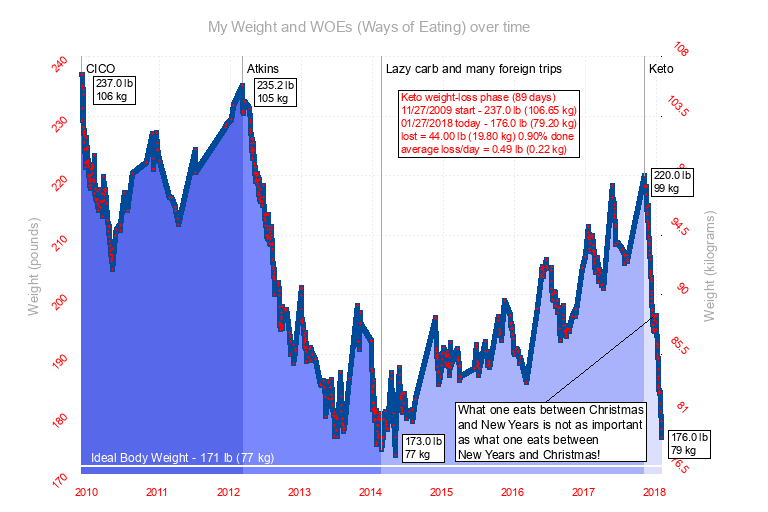
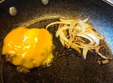
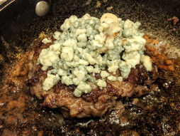
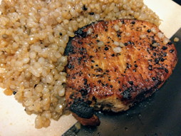
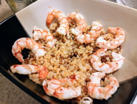
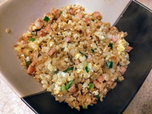
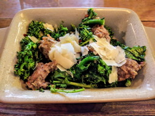

# SimplestKetoTM

Newcomers to keto are often frustrated by slow weight loss and confused by the flood of new information that comes along with a new way of eating. This is my experience; the simplest tough-love boot camp way of diving into keto, seeing the fastest weight loss, and gaining enough confidence to stick with keto long enough to absorb what's necessary for a sustainable lifelong maintenance phase.

## Who am I?

I'm you. My day is spent in an office. I'm not thrilled by, nor do I have time for, sweaty daily exercise. Food; I love everything about it: cooking, eating, researching exotic recipes. Without counting calories I ate what I wanted.

One day I woke up, rolled out of bed with a hurting back, made a grunty noise when I sat down, realized I couldn't see my toes, and was frustrated by how tired I was (and how many naps I craved or took). This weight had to come off!

I went through several different ways of eating: CICO (calories in < calories out), Atkins, lazy carbs, and now keto. Each previous effort saw weight coming off while I was mindful, even as I was a frustrated and hungry dieter, and the weight came back on when I got distracted because complying with the diets were hard. (This graph shows my progress over the years; the steep downward slope at right is keto.)

I stumbled onto keto in late 2017. I learned to watch both my calories and macronutrients (macros). I was impatient to get slimmer. It was a busy season, so I decided to work out the simplest and most effective way to get and stay on keto. This is the distillation of what I learned.

## What is keto?

Keto is a high-fat low-carb (HFLC) diet that switches your body into a fuel-burning state that consumes your body fat. Most of keto is counter-intuitive, flying against common folk wisdom that passes for "what everyone knows".

There's a lot for you to read out there, to gain a scientific underpinning of how and why keto works, even though all of it sounds wrong. You don't need to know any of it to get started, but you'll have plenty of time as you see the weight falling off :-)

## What must you bring to this?

* Suspension of disbelief for a limited period of time, 30-90 days; the loss phase. Forget everything you have been taught about healthy eating and dieting and just do this.

* An _overwelming_ desire to lose weight and the commitment to deprive yourself of the joys of complex eating while in the loss phase. Success with any diet requires that you adhere to its rules. I'll share the hard-core process I used; follow it, and win, or don't, and fail.

* Calculate an [ideal weight](https://www.calculator.net/ideal-weight-calculator.html) as a target. You don't need to get fixated on this number, but it's a dispassionate, scientifically-calculated outside view.

* Calculate [appropriate calorie and macronutrient levels](https://keto-calculator.ankerl.com/) for who you are today.

* A way of logging your daily food intake, to maintain awareness of your running calorie and macronutrient count. Both [LoseIt!](http://loseit.com/) and [MyFitnessPal](http://myfitnesspal.com/) have both web and smartphone apps.

* A digital body-weight scale. Weigh and log yourself each and every day at the same time, every morning.

* A digital food scale. You'll need to accurately log the weight of foods. Humans are terrible at estimating.

* A doctor's visit to ensure that you're healthy enough. You needn't state that you're planning on doing keto, especially as many physicians last learned (inaccurate information) about nutrition in med school. Just be healthy enough.

* Be aware of "keto flu" and "keto rage". During the transition from using carbs as fuel to using your body fat you may experience a short period of flu-like symptoms (treated with electrolytes; lite salt and broth, magnesium supplements) and you may have a short fuse.

## Enough already! Let's start!

Great that you're impatient. Here's what worked for me:

### Mindset

Get into the mindset. Nothing must be more important than getting into shape. Much as I wanted tantalizing keto-friendly foods, cheat days for non-keto foods, I vowed to eat only simple keto meals to make it easy to stick with it.

### Shopping

I claimed a kitchen cabinet and a refridgerator shelf. In the store I pored over nutritional labels, pretending to be zero-carb, knowing the tiniest bits of carbs will add up to the smallest possible total. I won't mention "low-carb" before each item, but you now know how to shop. (Don't look at fat content; fat will be your perfect fuel in the weeks to come.)

* unsalted butter
* lite salt (for the potassium)
* low-carb broth (for "keto flu")
* heavy whipping cream, half-and-half, or coconut creamer (Trader Joe's) (for coffee)
* garlic, grated in a glass jar (optional)
* any spices with a low-carb count
* several flats of eggs
* breakfast meats: low-carb salami, bacon
* almonds, roasted, salted or plain
* dinner meats:
	* beef, ground beef
	* pork, ground pork
	* salmon filet

For right now no fruit, no vegetables, no snacks, nothing sweet, no dairy, no substitute items (soy milk), no low-fat foods.

I'm sure I've forgotten a few things; feel free to tweak this list to your liking.

### Capture this moment

* By whatever method you chose, log your weight today.

* Take 'before' pictures, even though you may not be thrilled with your shape today. You _will_ regret not having them later, trust me. Take one set with street clothes, another in underwear. Do not get rid of those clothes before you hit your target weight :-)

### Start cooking and eating

Gauge your hunger. When you feel "hungry" take a moment to see whether it's a need for fuel or a need for comfort. Drink something; much of what we feel as hunger is actually thirst. Give yourself five minutes to sit with the hungry. Know you'll have moments of hungry; it's all good, you'll survive. Use sticky notes to remind yourself.

These are some of the things I ate during my keto loss phase. When I get pictures of others I'll update this page.

<table border="0">
	<tr><td></td><td><b>fried egg in butter</b> The simpliest. If I pair it with salami or bacon I cook the meat first and the egg in the fat in the pan.</b></td></tr>

	<tr><td></td><td><b>omelette</b> A 3-egg omelette with 2 oz SPAM and a touch of scallion.</td></tr>

	<tr><td></td><td><b>cheddar burger & onion</b> 3 oz 80% ground beef, 0.5 oz sharp cheddar, the tinest amount of onions. Some days I have several of these over my eating window.</td></tr>

	<tr><td></td><td><b>blue cheese burger</b> Same as above, but with crumbled blue cheese.</td></tr>

	<tr><td></td><td><b>pork chop & "rice"</b> 6 oz pork chop, shiritaki (Miracle Noodle) "rice" with Montreal steak spice.</td></tr>

	<tr><td></td><td><b>Poor man's paella</b> Shiritaki (Miracle Noodle) "rice" with a bit of Trader Joe's soy chorizo.</td></tr>

	<tr><td></td><td><b>Hawaiian breakfast</b> 2 oz SPAM, Shiritaki (Miracle Noodle) "rice", a touch of scallions & soy sauce.</td></tr>

	<tr><td></td><td><b>broccolini and Italian sausage</b> A notable restaurant meal. I confirmed only butter and salt, nothing else!</td></tr>

</table>

Does this limited menu get boring? Of course! Each time I reach into the fridge I remind myself that it's for a limited time, and that I'm doing this for a goal that I really, really want.

### Immerse yourself in community

While you're keto'ing use online communities to get more information about keto, keto-friendly recipes, and support for the struggle. I recommend [Reddit](http://reddit.com/r/keto).

### That's it! Just do it!

That's all you need to know to get started. I urge you to stay simple and be strict. Success to you!