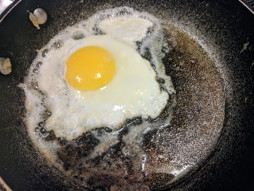
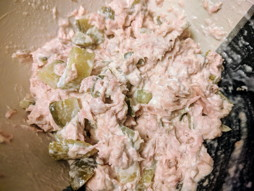

# SimplestKetoTM

version 1.0.3 -- Added to sleep, podcasts, stalls & plateaus, scholarly articles...

## keto, done as simply as possible

Newcomers to keto are often frustrated by slow weight loss and confused by the flood of new information that comes along with a new way of eating. This is my experience; the simplest tough-love boot camp way of diving into keto, seeing the fastest weight loss, and gaining enough confidence to stick with keto long enough to absorb what's necessary for a sustainable lifelong maintenance phase.

## Who am I?

I'm you. My day is spent in an office. I'm not thrilled by, nor do I have time for, sweaty daily exercise. Food; I love everything about it: cooking, eating, researching exotic recipes. Without counting calories I ate what I wanted.

One day I woke up, rolled out of bed with a hurting back, made a grunty noise when I sat down, realized I couldn't see my toes, and was frustrated by how tired I was (and how many naps I craved or took). This weight had to come off!

I went through several different ways of eating: CICO (calories in < calories out), Atkins, lazy carbs, and now keto. Each previous effort saw weight coming off while I was mindful, even as I was a frustrated and hungry dieter, and the weight came back on when I got distracted because complying with the diets were hard. (This graph shows my progress over the years; the steep downward slope at right is keto.)

I stumbled onto keto in late 2017. I learned to watch both my calories and macronutrients (macros). I was impatient to get slimmer. It was a busy season, so I decided to work out the simplest and most effective way to get and stay on keto. This is the distillation of what I learned.

## What is keto?

Keto is a low-carb high-fat diet (LCHF) diet that switches your body into a fuel-burning state that consumes your body fat. Most of keto is counter-intuitive, flying against common folk wisdom that passes for "what everyone knows".

There's a lot for you to read out there, to gain a scientific underpinning of how and why keto works, even though all of it sounds wrong. You don't need to know any of it to get started, but you'll have plenty of time as you see the weight falling off :-)

## What must you bring to this?

* Suspension of disbelief for a limited period of time, 30-90 days; the loss phase. Forget everything you have been taught about healthy eating and dieting and just do this. For the duration believe that fat is great, sugar is evil, and carbs are bad.

* An _overwelming_ desire to lose weight and the commitment to deprive yourself of the joys of complex eating while in the loss phase. Success with any diet requires that you adhere to its rules. I'll share the hard-core process I used; follow it, and win, or don't, and fail.

* Calculate an [ideal weight](https://www.calculator.net/ideal-weight-calculator.html) as a target. You don't need to get fixated on this number, but it's a dispassionate, scientifically-calculated outside view.

* Calculate [appropriate calorie and macronutrient levels](https://keto-calculator.ankerl.com/) for who you are today.

* A way of logging your daily food intake, to maintain awareness of your running calorie and macronutrient count. Both [LoseIt!](http://loseit.com/) and [MyFitnessPal](http://myfitnesspal.com/) have both web and smartphone apps.

* A digital body-weight scale. Weigh and log yourself each and every day at the same time, every morning.

* A digital food scale. You'll need to accurately log the weight of foods. Humans are terrible at estimating.

* A doctor's visit to ensure that you're healthy enough. You needn't state that you're planning on doing keto, especially as many physicians last learned (inaccurate information) about nutrition in med school. Just be healthy enough.

## Enough already! Let's start!

Great that you're impatient. Here's what worked for me:

### Mindset

Get into the mindset. Nothing must be more important than getting into shape. Much as I wanted tantalizing keto-friendly foods, cheat days for non-keto foods, I vowed to eat only simple keto meals to make it easy to stick with it.

### Shopping

I claimed a kitchen cabinet and a refridgerator shelf. In the store I pored over nutritional labels, pretending to be zero-carb, knowing the tiniest bits of carbs will add up to the smallest possible total. I won't mention "low-carb" before each item, but you now know how to shop. (Don't look at fat content; fat will be your perfect fuel in the weeks to come.)

* unsalted butter
* lite salt (for the potassium)
* low-carb broth (for "keto flu")
* heavy whipping cream, half-and-half, or coconut creamer (Trader Joe's) (for coffee)
* garlic, grated in a glass jar (optional)
* any spices with a low-carb count
* several flats of eggs
* breakfast meats: low-carb salami, bacon
* almonds, roasted, salted or plain
* dinner meats:
	* beef, ground beef
	* pork, ground pork
	* salmon filet

For right now no fruit, no vegetables, no snacks, nothing sweet, no dairy, no substitute items (soy milk), no low-fat foods.

I'm sure I've forgotten a few things; feel free to tweak this list to your liking.

### Electrolytes before you start

A side-effect of nutritional keytosis is your body flushing out more water than usual, along with electrolytes; sodium, potassium, and magnesium. Behavioral side-effects include:

* **keto flu** -- During the transition from using carbs as fuel to using your body fat you may experience a intense period of flu-like symptoms: aches, low energy.

* **keto rage** -- You may also be ill-tempered, have a short fuse, or experience the hangry without the hungry.

Replenish these very important electrolytes most easily wih:

* **light salt** -- Most groceries contain salt substitutes that are either half or completely potassium chloride (with perhaps a trace of magnesium carbonate). Check the label to ensure no sugar, no carbs.

* **magnesium supplement** -- Any store with supplements may have magnesium citrate, the cheapest, most bioavailable kind.

Check labels and online for amounts to use, side-effects, and recipes for _ketoade_ (a drinkable way to replenish).

### Capture this moment

* By whatever method you chose, log your weight today.

* Take 'before' pictures, even though you may not be thrilled with your shape today. You _will_ regret not having them later, trust me. Take one set with street clothes, another in underwear. Do not get rid of those clothes before you hit your target weight :-)

### Weigh and log before you eat

With whatever diet / way of eating you choose, the key idea is that you _must_ eat less calories than you consume. This is called _deficit_. Walking and sports can add to this deficit, but if you're taking in more than you burn you will gain weight.

Most humans are terrible at estimating quantities. Counter this by weighing and logging each ingredient (or prepared food) before it enters your mouth.

### Keto lore

* **bulletproof coffee** - [Brewed hot coffee mixed with unsalted butter, ghee, MCT (medium-chain triglyceride) oil, or coconut oil](https://www.nytimes.com/2014/12/14/style/the-cult-of-the-bulletproof-coffee-diet.html). It's _not_ essential for keto. You don't _need_ special coffee beans, butters, or MCT oils, although you may choose later on to try more expensive offerings. (In fact, I consume most of my carbs one tablespoon at a time of [Trader Joe's Coconut Creamer](https://www.traderjoes.com/fearless-flyer/article/2118). I still hold my head up.)

* **bacon** - Through publicity, bacon is the the gateway drug to keto. Most of us don't have it for breakfast, lunch, dinner, and snack. If it fits your macros, and you desire it, consume. If it doesn't, don't.

* **ketone test strips** - Show urine ketone level, available through pharmacies. Completely unnecessary, save your money for good meats. If you're eating less than 20 g carbs / day you're in ketosis.

### Start cooking and eating

Gauge your hunger. When you feel "hungry" take a moment to see whether it's a need for fuel or a need for comfort. Drink something; much of what we feel as hunger is actually thirst. Give yourself five minutes to sit with the hungry. Know you'll have moments of hungry; it's all good, you'll survive. Use sticky notes to remind yourself.

Note: At some point it's worth experimenting with hard cheeses and broccoli, cauliflower, and spinach. I haven't yet, because this is my hard-core weight-loss phase, but I'll be adding them in as I transition to maintenance mode.

Note: Ensure you're hydrated, as you'll be flushing out water on keto. Enjoy everything low- or no-carb; water with a touch of lemon juice, tea, coffee. No alcohol during the loss phase. 

These are some of the things I ate during my keto loss phase. When I get pictures of others I'll update this page.

| Awesome picture | Mundane description |
|---|---|
|  | <b>fried egg in butter</b> The simpliest. If I pair it with salami or bacon I cook the meat first and the egg in the fat in the pan. |
|  | <b>omelette</b> A 3-egg omelette with 2 oz SPAM and a touch of scallion. |
|  | <b>cheddar burger & onion</b> 3 oz 80% ground beef, 0.5 oz sharp cheddar, the tinest amount of onions. Some days I have several of these over my eating window. |
|  | <b>blue cheese burger</b> Same as above, but with crumbled blue cheese. |
|  | <b>pork chop & "rice"</b> 6 oz pork chop, shiritaki (Miracle Noodle) "rice" with Montreal steak spice. |
|  | <b>Poor man's paella</b> Shiritaki (Miracle Noodle) "rice" with a bit of Trader Joe's soy chorizo. |
|  | <b>Hawaiian breakfast</b> 2 oz SPAM, Shiritaki (Miracle Noodle) "rice", a touch of scallions & soy sauce. |
|  | <b>tuna</b> One can of tuna, 2 tbsp mayo, 1 pickle cubed. |
|  | <b>broccolini and Italian sausage</b> A notable [restaurant](http://pizzeriarosso109.com) meal. I confirmed only butter and salt, nothing else! |

Does this limited menu get boring? Of course! Each time I reach into the fridge I remind myself that it's for a limited time, and that I'm doing this for a goal that I really, really want.

My version of dead simple isn't the same as others, although I picked it because it lets me  skate close to no-carb during the loss phase. A reviewer shares their method: Start with a vegetable that grows above ground. Add a variety of interesting proteins and fats in the form of meat, oil, a few nuts, cheese, and lots of salt. Fry or bake. (With this method you must be doubly sure to keep an eye on creeping daily carb count.)

From another reviewer comes this version of basic keto: ...occasional salad greens, salsa, green beans, cabbage; rarely, but as desired within my 20 carb limit. I found kelp noodles which I’ve used once and enjoyed...

Yet another said: Boredom is another reason people give up diets. Eating only protein and fat, stuff with a lot of umami, flavor would make me hate food and life. It’s literally no issue to work broccoli, spinach, and zucchini into the diet and stay under the carb amount.

Also "[for breakfasts] I'll do deli slices in bacon grease, sausages, breakfast sausage, and just cheese sticks; never fancy unless I do eggs. For eggs: whisk with coconut milk, heavy cream, or whole milk. Working on cream cheese and egg pancakes: 1oz cream cheese per large egg, blend and pour in greased or buttered pan, powder with Stevia."

Another note about vegetables: I've been asked why vegetables don't feature more prominently (or at all) in my weight-loss keto implementation.

1. We've all been raised with the "truth" that fats are bad, fruits and veggies and salads are good, and low-fat substitutes are the key to healthy living. Fats are your optimal fuel. Fruts are sugar bags. Some veggies are carb bombs. To build self-assurance about keto, to demonstrate by actual weight loss, confidence is built from a demonstration diet free of those purportedly healthy foods, butressing newcomers confidence before that early window of time in which most quit any new diet and revert to unhealthy eating. Carbs from veggies just complicate building this confidence. (I do believe some vegetables should be adding during the keto maintenance phase.)

1. To rid newcomers of the "I couldn't ever give up that food" mentality; it holds people back from jumping into keto completely. Fruits, vegetables, and salads are not an essential part of you taking control over your ever-heavier body; you can see it on your scale. 

1. To inculcate the mind-numbing truth that it's possible to fuel your body during the weight-loss phase without fruits, veggies, or salads, and without hunger pangs, carb cravings, or ruinous bodily breakdown.

1. The _need_ for fruits and vegetables isn't as clear-cut as our mothers would have us believe. While I've drawn no conclusions yet, my reading uncovers that meat is much more nutritionally dense than veggies, provide all needed nutrients (or precursors), and is more bioavailable than vegetables (to which some people have reactions). We were taught that lemons cured scury, but never that meat also does. Zero-carbers have been without veggies for an extended period of time without seeming issues. There are questions about the need for fiber. All of this requires more research and reading.

### Work on your relationship with food

Most of use use food as comfort.

The saw-tooth pattern you see in my graph, above, shows the effects of complacence (perhaps denial) and stress that comes with job loss, divorce, selling a house, and a handful of foreign trips (which had very notable, almost famous, high-carb foods that I just _had_ to have). Also easy to see are the key decision points during that stressful time; I got frustrated with my weight, got back on low-carb, got distracted, and the result was yo-yo dieting.

My success on keto is due to :

1. ease of following this way of eating

1. an obsessive habit of reminding myself why I'm doing this restrictive, minimalist eating during this weight-loss phase

1. a burning commitment on winning each meal, not snacking in-between, and absolutely no self-sabotaging cheat until I hit my target weight

1. a gentleness with myself, to get through the mental break at not eating every few hours, just sitting with any late-night hunger rather than running to the kitchen cabinet or refrigerator

### Sleep

According to Dr Will Cole], speaking in [KetoTalk #45](http://ketotalk.com/2016/12/45-very-low-ketones-while-fit-cold-hands-feet-sleep-raising-ketones-salt-excessive-calories/), "sleep stage 3 and 4" is essential to keytone levels and weight loss. Do what you need to get good chunks of good sleep.

### Stalls & plateaus

The term stall (or plateau) refers to successful weight loss that stops, despite continued keto. There are a good number of lay theories about this, as well as suggested ways to "break a stall".

* go on an extended fast, removing calories

* eat less food, lowering calories

* add more food, upping calories

* eat special food, like the "egg fast"

* try 16:8 or 20:4 [intermittent fasting](https://en.wikipedia.org/wiki/Intermittent_fasting) if you're not already doing IF

Until recently I didn't have experience with stalls. Now, at about 12 lbs (5.5 kg) above the calculated ideal weight, my daily weight-loss has gone from about 0.46 lb (0.21 kg) to zero. Now I understand the panicked frustration I've heard others use in discussing stalls.

Coincidentally I heard Dr Will Cole], speaking in [KetoTalk #45](http://ketotalk.com/2016/12/45-very-low-ketones-while-fit-cold-hands-feet-sleep-raising-ketones-salt-excessive-calories/), say eating too few calories causes fat cells to not release fat. I've been eating under my calorie limit and for the last few days have done a lot more walking; I may have tipped the hormonal balance out of my favor.

So my first attempt at breaking this stall is to continue on my keto, being mindful to hit my [calculated](https://keto-calculator.ankerl.com/) daily calorie intake.

### Get educated

The following is a very imperfect and incomplete list of some of the resources I find helpfule.

#### Immerse yourself in community

While you're keto'ing use online communities to get more information about keto, keto-friendly recipes, and support for the struggle. I recommend [Reddit](http://reddit.com/r/keto).

#### Watch videos

* [The Perfect Human Diet](http://www.imdb.com/title/tt2014248/), 2012.

#### Listen to podcasts

* [Keto Talk with Jimmy Moore & Dr Will Cole](http://ketotalk.com/)
* [Keto for Normies](http://ketoconnect.libsyn.com/website)

#### Read scholarly articles

* Journal of the American Medical Association, _[Interest in the Ketogenic Diet Grows for Weight Loss and Type 2 Diabetes](https://jamanetwork.com/journals/jama/fullarticle/2669724)_, Jennifer Abbasi, 2018.

* Experimental & Clinical Cardiology, _[Long-term effects of a ketogenic diet in obese patients](https://www.ncbi.nlm.nih.gov/pmc/articles/PMC2716748/)_, 2004.

* International Journal of Environmental Research and Public Health, _[Ketogenic Diet for Obesity: Friend or Foe?](https://www.ncbi.nlm.nih.gov/pmc/articles/PMC3945587/)_, Antonio Paoli MD, 2014.

* Derek Beres, _[How the Keto Diet—Even Without Exercise—Slays the Opposition](http://bigthink.com/21st-century-spirituality/how-the-keto-diet-with-no-exercise-outperforms-the-standard-american-diet-with-exercise)_, 2017.

* Peter Attia MD, _[Ketosis – advantaged or misunderstood state? (Part I) ](https://peterattiamd.com/ketosis-advantaged-or-misunderstood-state-part-i/)_, 2012.

* Peter Attia MD, _[Ketosis – advantaged or misunderstood state? (Part II)](https://peterattiamd.com/ketosis-advantaged-or-misunderstood-state-part-ii/)_, 2013.

* Peter Attia MD, _[How to make a fat cell less not thin: the lessons of fat flux](https://peterattiamd.com/how-to-make-a-fat-cell-less-not-thin-the-lessons-of-fat-flux/)_, 2013.

* SCI-FIT, _[A Collection of 200+ Keto and Carbohydrate Studies](http://sci-fit.net/2017/keto-study-collection/)_, Adam Tzur, 2017.

### That's it! Just do it!

That's all you need to know to get started. I urge you to stay simple and be strict. Success to you!