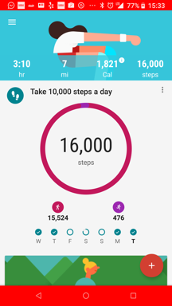
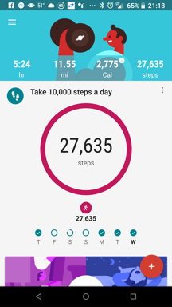
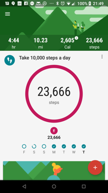

# Fasting on keto

| Note |
| :--- |
| This is a snippet. See other snippets [here](https://github.com/mickeys/lose-weight-keto/tree/master/snippets). [SimplestKeto](https://github.com/mickeys/lose-weight-keto/blob/master/simplest-keto-how-to-start.md)TM is the main page. |

This is a recounting of my first longer-term fast, which I decided to do because I hit a [plateau](./plateaus_and_stalls.md) (sometimes called a 'stall') which a week of [intermittent fasting](intermittent_fasting.md) didn't break.

This is a water fast. Water, electrolytes, squeeze of lemon. Nothing more. (Those of you know how much I love coffee won't believe it, but there it is.)

## Backstory

Perhaps my fear of fasting will help you through yours; here's how it came to be.

As a carb-burning child, if I didn't eat three times daily I would get splitting headaches. (Most frequently in my lunchbox were two peanut butter and jelly sandwiches, which I often didn't eat because the bread got so soggy.) In college I never let myself get hungry, got the "freshman fifteen", and would up losing the weight by eating every day only half a pizza instead of a whole one.

Fear of being hungry has always been with me, even through years of low-carb eating. There's always a baggie of almonds with me.

## Day 0

Having decided to start a fast tomorrow I make a bone broth to sustain me through this ordeal of horror. I watch Dr Fung's videos about fasting, reassured by his insistence that fasting is but an extension of keto.

[The Complete Guide to Fasting & How to Burn Fat - Jason Fung, MD (2017)](http://www.youtube.com/watch?v=n3dwizlGaRI)

We're already burning our body fat, so fasting just pushes us to burn only body fat. I listen to Jimmy Moore's tale of his several long-term fasts. I guess I'm ready.

[Jimmy Moore - Not Just Another 'F' Word - My Personal Experience With Fasting](http://www.youtube.com/watch?v=aQuDq5aGXAA)

## Day 1

Weight: 183.6 lb (83 kg)

This is the weight at which I stalled (after losing 36 pounds (16 kilograms) over a couple of months. I'm impatient; I don't want to wait weeks or months (as I've read others have) to break this plateau. I want to get to my target wait and start cooking keto meals _now_.

I spend the day not eating; my food tracker mocks me. There is no physical discomfort; no rumbly tummy; no light-headedness, weakness, or being tired.

At day's end the mental game bests be, and I drink a cup of bone broth just to have ingested _anything_ at all; not eating is just too weird. Immediately I regret it, but it is what it is. Tomorrow is another day.

## Day 2

Weight: 181.8 lb (82 kg) 
Change: -1.8 lb (-0.8 kg)

Morning: Plateau broken! I wake expecting the worst, but I'm amazed to feel wonderful, like I've already had a hearty keto breakfast. I'm full of energy and good mood. I take a long walk in the sunshine, marveling that it's even possible. This is the longest time I've fasted since the annual  headache and mood horrors of Yom Kippur. My body is feasting on body fat, and it's all happy, and I'm agog.

With one fast day complete I'm seeing that fasting is a **complete mind game**. Eating is such a comfort, the cooking rituals and the reward food. The dormant kitchen is hard to bear. The silent coffee machine is downright disconcerting. For me it's harder than switching to keto.

I take my [magnesium citrate](snippets/magnesium_bioavailability.md) tablets and put lite salt (for potassium) and a bit of lemon juice in my water bottle. I think of it as "savory water"; no added flavoring neede.

Afternoon: I'm doing no exercise during my keto loss phase except for walking. Usually it's 5-10,000 steps; today was a bit more.

Evening: Amazingly, no hunger at all. I was told that ghrelin, the hunger hormone, spikes on he second day of fasting, but not for me. I'm craving bacon and parmesan cheese (both comfort snack foods) but no traditional hungry symptoms: no tummy rumbles, no headache, no real _need_. Eh, time for bed.
 

## Day 3

Weight: 180.4 lb (81 kg) 
Change: -3.2 lb (-1.5 kg)

Morning: I wake up early, full of energy. I was expecting the opposite, but my ketogenic body is silly-happy nibbling on my body fat. I'm completely satiated, like breakfast was a half-hour ago.

Afternoon: I'm walking now, and I notice that my upper arms feel a bit weak, as they do after push-ups (said as comparison; I haven't done any during this keto loss phase to change only one variable). Update: weakness all gone, and quickly. Maybe I made my bed pillow fort badly last night :-)

Evening: Three days and no hunger pangs? I can't believe it! This is really validating that my fat is feeding me. Wow. I knew it from the weight loss over the last 2.5 months, but this adds another level of certainty.

It was hard being at my sister's house as they dug into freshly-delivered pizza, and harder walking by an aromatic burger restaurant, but some how I survived and am back at home, without any feelings of hunger except for my learned behavior of "eat in the evening and have some warm, savory comfort". No actual pressure to eat.
 

## Day 4

Weight: 178.8 lb (81.1 kg) 
Change: -4.8 lb (-2.2 kg)

The plateau is completely broken; thank you [Dr Fung](http://www.youtube.com/watch?v=n3dwizlGaRI)!

Morning: No hunger, but my brain sorely wants the rituals of cooking: the smell of the salami, the sizzle of the eggs. I'm thirsty, really thirsty, constantly sipping my [ketoade](./ketoade.md), but not hungry.

Afternoon: Walked. No flagging energy, my mood is estatic, no mental fog. Carrying lunch around my belly is working just fine.

Evening: Having frequent intrusive thoughts about pizza and "wet" burritos, but no actual hunger. Feeling the social brain buzz urging me to go cook something, for the sizzle and smell, but it's at a distance, not compelling. Soon it's bed-time and I've had another day of fasting without any inconvience (tho I still can't believe it).

## Day 5

(sweet dreams, me)

| Please help keep this accurate |
| :--- |
| If you can cite more recent peer-reviewed clinical studies please let me know at  <a href='&#109;ai&#108;to&#58;&#109;%69c%68&#97;el%&#52;0&#115;&#97;&#116;&#116;le&#37;&#55;2&#115;&#37;2E&#37;6F%72&#103;'>mich&#97;&#101;&#108;&#64;sa&#116;tler&#115;&#46;org</a>. Thanks!